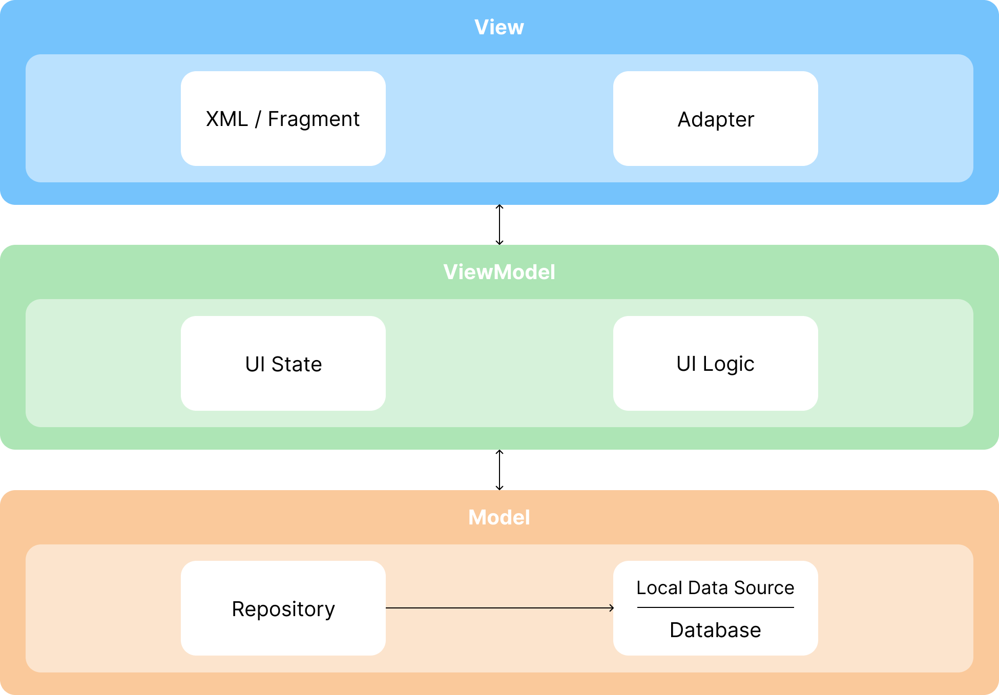

# 📱 Instafolio

광고 업계 포트폴리오를 인스타그램 이미지 형식으로 손쉽게 변환해주는 Android 앱 입니다.

---

## 🔍 Overview

Instafolio는 광고 업계 학생 및 취업 준비생들이  
PDF 기반 포트폴리오 작업물을 인스타그램에 업로드하는 과정에서 겪는  
캡처 · 변환 · 편집의 반복적인 불편함을 해결하기 위해 개발된 모바일 앱입니다.

네트워크 연결 없이도 안정적으로 동작하는 작업 중심 앱을 목표로 하였으며,  
다양한 파일 형식을 인스타그램 이미지 규격에 맞게 편집할 수 있도록 설계했습니다.

- **진행 형태**: 팀 프로젝트  
- **개발 기간**: 2022.09 ~ 2022.11  
- **담당 역할**: Android 앱 개발 전반  

---

## ✨ Key Features

- PDF / PNG / JPG 형식의 파일 불러오기 및 저장 지원
- 다수의 이미지를 인스타그램 규격(1:1)에 맞게 병합
- 포트폴리오 특성을 고려한 두 페이지 단위 편집 기능
- Drag & Drop 기반 페이지 순서 변경
- 최근 편집 작업 로컬 저장 및 재편집 지원

---

## 🚧 Challenges & Solutions

### 🔹 연속된 아이템 복수 선택 UI 구현

**문제**
- 연속된 두 이미지를 하나의 박스 형태로 선택하는 UI 요구
- RecyclerView 구조상 여러 아이템 위에 공통 View를 그리기 어려움

**해결**
- 공통 View 대신 각 아이템의 테두리를 개별적으로 그려
  시각적으로 하나의 박스처럼 보이도록 구현
- 하나의 아이템 선택 시 오른쪽 아이템이 함께 선택되도록 로직 구성

**결과**
- RecyclerView 구조를 유지하면서 복수 아이템 선택 UX 구현

---

### 🔹 복수 선택 아이템 Drag & Drop 문제

**문제**
- 기존 Drag & Drop 라이브러리는 연속된 복수 아이템 이동을 지원하지 않음

**해결**
- 첫 번째 아이템만 실제 Drag 대상으로 사용
- 두 번째 아이템은 임시로 리스트에서 분리한 뒤
  View 레벨에서 병합하여 함께 이동하는 것처럼 처리
- Drop 시 두 번째 아이템을 기준 위치 바로 오른쪽에 재삽입

**결과**
- 내부 구현은 단일 아이템 이동
- 사용자 입장에서는 두 아이템이 함께 이동하는 자연스러운 UX 제공

---

## 🔧 Improvements

### 🔹 이미지 데이터 메모리 관리 개선

**문제**
- Fragment 간 이미지 공유를 위해 Shared ViewModel 사용
- 대용량 이미지 데이터가 메모리에 오래 남을 위험 존재

**개선 방향**
- Fragment별 ViewModel로 분리
- 화면 전환 전 이미지 데이터를 로컬에 임시 저장
- 전환 이후 파일 경로만 전달하여 필요한 시점에 로드

**배운 점**
- ViewModel은 UI 상태 관리에 집중해야 함
- 대용량 데이터는 별도 저장소를 활용하는 것이 바람직함

---

## 🧱 Architecture & Design

화면 로직(UI)과 비즈니스 로직(데이터 처리)을 명확하게 분리하기 위해 MVVM 패턴을 적용했습니다. 각 계층은 다음과 같은 명확한 책임을 가집니다.

- View (UI): 사용자에게 보여지는 UI를 담당하며, 모든 사용자 이벤트(버튼 클릭, 목록 선택 등)를 ViewModel로 전달하는 역할만 수행합니다. 데이터가 어떻게 변경되고 저장되는지에 대해서는 관여하지 않습니다.
- ViewModel: 화면에 필요한 데이터를 LiveData 형태로 소유하고, UI 상태(예: 편집 모드 여부, 선택된 아이템 목록)를 관리합니다. View로부터 이벤트를 전달받으면, 필요한 비즈니스 로직을 수행한 후 Model 계층에 데이터 처리를 요청합니다.
- Model (Repository, Room Database): 애플리케이션의 데이터를 책임지는 계층입니다. Repository는 데이터 입출력을 총괄하고, Room Database는 데이터를 기기 내에 영구적으로 저장합니다.

---

## 🛠️ Tech Stack

| **Category** | **Tech Stack** |
| --- | --- |
| **Language** |  |
| **Platform** |  |
| **Architecture** |  |
| **Async & State** | ,  |
| **Local Data** |  |
| **Jetpack** | , ,  |

---

## 🔗 Links

- **Notion Portfolio**  
  https://bouncy-rover-a1d.notion.site/2e0f88e182a580638317da51684a8850

- **Figma**  
  https://www.figma.com/design/PmuHWIVfsxLw4fLDYynwR6/%EC%9D%B8%EC%8A%A4%ED%83%80%ED%8F%B4%EB%A6%AC%EC%98%A4

- **Instagram**  
  https://www.instagram.com/instafolio.official/
