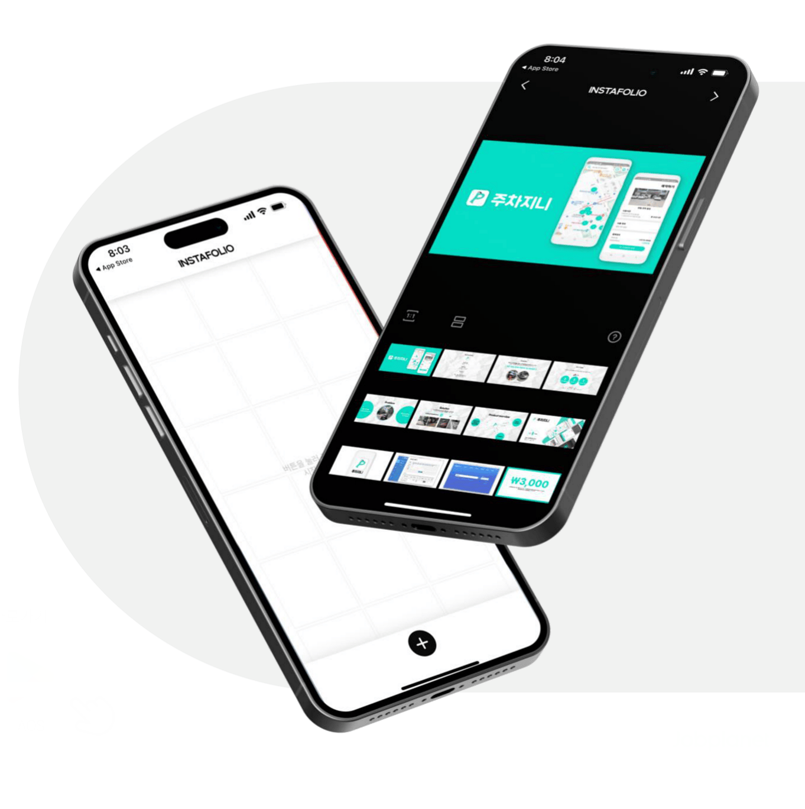
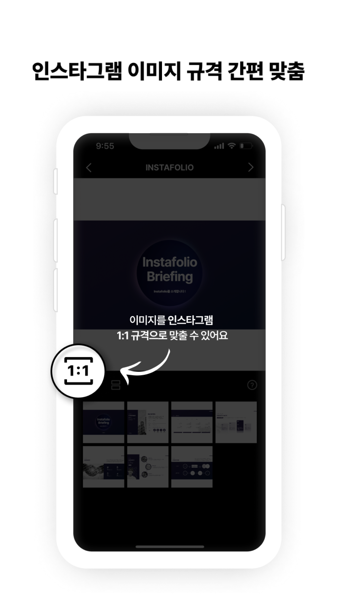
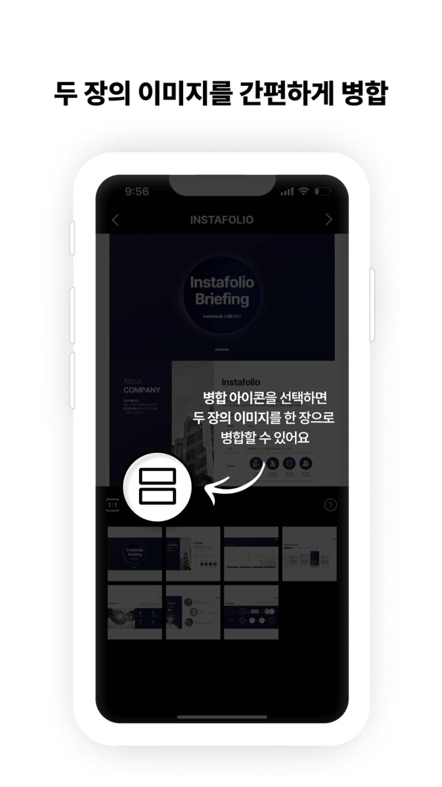
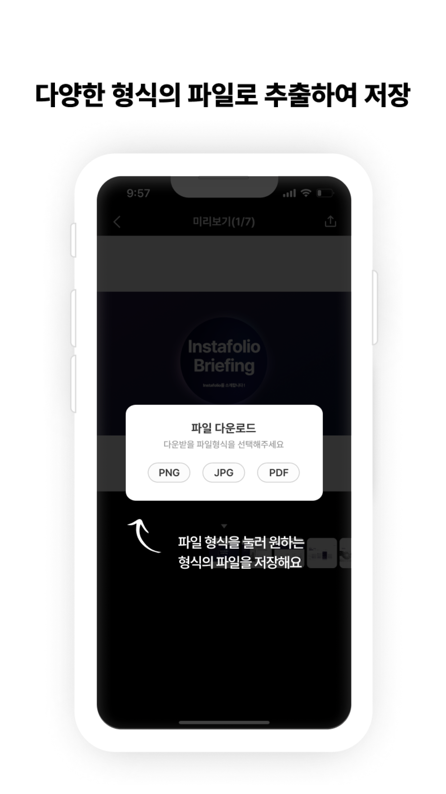
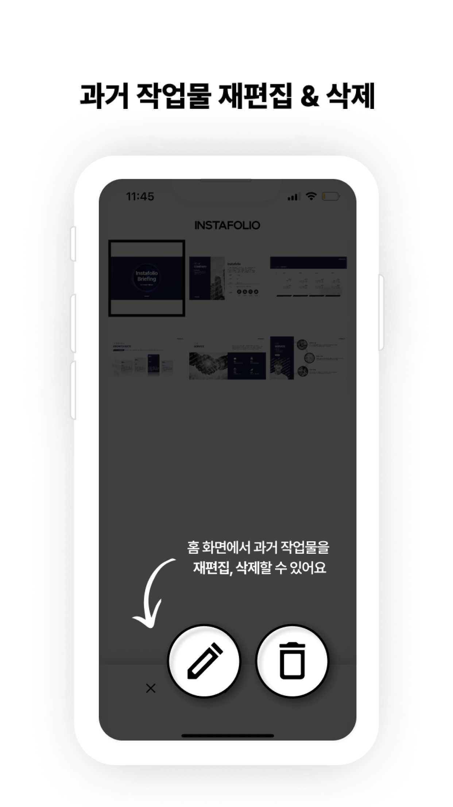

# 인스타폴리오(instafolio)

📷 많은 광고 업계 학생 및 취업 준비생들이

PDF 기반 포트폴리오 작업물을 인스타그램에 업로드하는 과정에서 불편함을 겪습니다. 

인스타폴리오는 **가장 쉽고 빠르게 인스타그램 포트폴리오를 만드는 앱** 입니다.

 

## ✨ 핵심 기능

  
  
  

  
  

- PDF / PNG / JPG 형식의 파일 저장 및 불러오기 지원
- 다수의 이미지를 인스타그램 규격(1:1)에 맞게 비율 간편 맞춤
- 한 페이지의 정보 밀도를 높일 수 있도록 두 장의 페이지를 한 장의 페이지로 묶어 병합
- Drag & Drop으로 페이지 순서 편집
- 최근 저장한 작업 재편집

 

## 👤 담당 역할

- Android 개발자로서 앱 아키텍쳐 설계 및 기능 구현 담당

 

## **🔧 주요 개발 내용**

### **MVVM Architecture**

- UI 로직과 상태 관리를 분리하기 위해 MVVM을 도입
- ViewModel에서 LiveData를 기반으로 데이터를 관리하고 View(Fragment)에서 구독하여,
  데이터 변경 시 UI가 자동으로 갱신되는 반응형 UI를 구축

### **다양한 파일 형식 입출력 지원**

- ContentResolver와 Intent 활용하여 파일의 Uri를 받아옴
- PDF 파일인 경우 안드로이드 내장 PdfRenderer를 사용하여 각 페이지를 순회하며 이미지 Bitmap으로 변환
- 이미지를 PDF로 변환하려는 경우 itextpdf 라이브러리를 이용해 이미지 Bitmap을 PDF로 변환

### 로컬 데이터 관리

- 네트워크 연결 없이도 사용자의 작업 내용을 안정적으로 보존하기 위해 Room 데이터베이스를 도입하고 Repository 패턴을 적용하여 데이터 계층을 설계
- ResultSlide(작업 결과물)를 @Entity로 정의하고, 데이터의 삽입, 삭제, 조회를 위한 ResultSlideDAO 인터페이스를 설계 및 구현

### **커스텀 Drag & Drop 기능**

- ItemTouchHelper.Callback을 상속하는 ItemTouchHelperCallback 클래스를 구현하여
  아이템 이동(onMove) 및 상태 변경(onItemSelected) 시의 동작을 직접 제어
- 두 아이템이 하나로 묶인 상태에서도 함께 이동하는 기능을 구현

 

## 🏗️ 아키텍쳐

화면 로직(UI)과 비즈니스 로직(데이터 처리)을 명확하게 분리하기 위해 MVVM 패턴을 적용했습니다. 각 계층은 다음과 같은 명확한 책임을 가집니다.

UI 로직과 비즈니스 로직을 명확하게 분리하기 위해 MVVM 패턴을 적용함. 각 계층은 다음과 같은 명확한 책임을 가짐.

- **View**
    - 사용자에게 보여지는 UI를 담당하며 모든 유저 이벤트를 ViewModel로 전달하는 역할을 수행
- **ViewModel**
    - 화면에 필요한 데이터를 LiveData 형태로 보유하고 UI 상태(편집 모드 여부, 선택된 아이템 목록 등)을 관리
    - View로부터 이벤트를 전달받으면 Model 계층에 비즈니스 로직 수행을 요청
- **Model**
    - 애플리케이션의 비즈니스 로직을 책임지는 계층
    - Repository는 데이터 입출력을 총괄하고 Room Database는 데이터를 기기 내에 영구적으로 저장함

 

## 🛠️ 기술 스택

| **Category** | **Tech Stack** |
| --- | --- |
| **Language** |  |
| **Platform** |  |
| **Architecture** |  |
| **Async & State** | ,  |
| **Local Data** |  |
| **Jetpack** | , ,  |

 

## 🔗 링크

- **Notion**  
  https://www.notion.so/INSTAFOLIO-284f7c60382844b287a998bd3c2f6620?pvs=24
